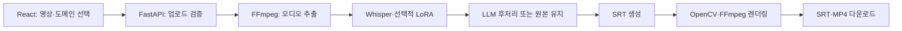

# CapTune | Auto Subtitle Service

영상 업로드부터 한국어 음성 전사, 자막 후처리, SRT 생성과 자막 영상 다운로드까지 연결하는 자동 자막 서비스입니다.

**Python · FastAPI · Whisper large-v3 · LoRA/PEFT · React · FFmpeg · OpenCV**

## 프로젝트 개요

음성 인식 결과를 실제 영상 자막으로 사용하려면 전사뿐 아니라 시간 정보, 문장 정리, 한글 렌더링과 파일 제공까지 연결해야 합니다. 이 저장소는 AI 추론 코드와 FastAPI API, React 사용자 화면을 함께 구성한 프로젝트입니다.

| 구분 | 구현 내용 |
|---|---|
| 입력 | 영상 업로드와 도메인 선택 |
| 음성 처리 | FFmpeg 기반 오디오 추출, Whisper 한국어 전사 |
| 도메인 적응 | 지원 도메인의 LoRA 어댑터 로드, 적용 불가 시 기본 모델로 전환 |
| 후처리 | 외부 LLM 서비스 연동, 실패 시 원본 전사 유지 |
| 출력 | 타임스탬프가 있는 SRT와 자막을 입힌 MP4 |
| 화면 | 업로드, 전사 결과·적용 도메인 확인, 세그먼트 편집 UI, 다운로드 |

## 처리 흐름



통합 진입점은 [`POST /upload/process`](backend/app/routes/upload.py)입니다. 응답에 `requested_domain`, `applied_domain`, `used_adapter`, `fallback_used`, `llm_used` 등을 포함해 실제 처리 경로를 확인할 수 있습니다.

## 기술적으로 살펴볼 부분

- [Whisper 추론 서비스](backend/app/services/whisper_service.py): 기본 모델과 도메인별 파이프라인을 구성하고 캐시합니다.
- [LoRA 선택 로직](backend/app/services/lora_registry.py): 허용 도메인과 어댑터 경로를 확인합니다. 현재 서비스에서 선택 가능한 도메인은 `general`, `social_news`, `ent`, `vacation`, `politics`입니다.
- [LLM 후처리](backend/app/services/llm_service.py): 응답의 문장·세그먼트를 정규화하고, 호출 실패 시 기존 전사를 보존합니다.
- [한글 자막 렌더링](backend/app/services/opencv_render_service.py): 자막 시간, 읽기 시간과 폰트를 다루고 원본 오디오를 합칩니다.
- [React API 연동](frontend/src/services/api.js): 영상 전송과 결과 다운로드 주소 처리를 분리합니다.

## 디렉터리

```text
backend/app/
  routes/       업로드·자막 처리·다운로드 API
  services/     오디오 추출·ASR·후처리·SRT·렌더링
  config.py     모델, 어댑터와 데이터 경로
backend/tests/  기본 상태 확인 테스트
frontend/       React 화면
ai/scripts/     데이터 준비·도메인별 LoRA 학습·WER/CER 평가
ai/data/        학습·평가 자료와 어댑터 결과
data/           서비스 입출력 파일
docs/           아키텍처·API 개발 문서
```

## 로컬 실행

Python 3.11, Node.js/npm, `ffmpeg` 실행 파일을 준비합니다. 기본 모델은 `openai/whisper-large-v3`이므로 최초 모델 다운로드와 추론에 필요한 저장공간·메모리가 필요합니다.

### 1. Backend

저장소 루트에서 실행합니다.

```powershell
python -m venv .venv
.\.venv\Scripts\Activate.ps1
python -m pip install -r requirements.txt
ffmpeg -version

# 사용할 후처리 서버가 없으면 비워 두어 원본 전사 유지 경로를 사용합니다.
$env:LLM_SERVICE_URL=""
python -m uvicorn backend.app.main:app --reload --port 8000
```

API 문서는 `http://localhost:8000/docs`, 상태 확인은 `http://localhost:8000/health/`입니다.

### 2. Frontend

별도 터미널에서 실행합니다.

```powershell
cd frontend
npm install
$env:REACT_APP_API_BASE="http://localhost:8000"
npm start
```

브라우저에서 `http://localhost:3000`으로 접속합니다.

### 설정

| 항목 | 위치·설명 |
|---|---|
| Backend 주소 | Frontend의 `REACT_APP_API_BASE` |
| LLM 후처리 서버 | `LLM_SERVICE_URL`, `LLM_SERVICE_TIMEOUT_SECONDS` |
| 한글 폰트 | `OPENCV_FONT_PATH`로 실행 환경의 한글 폰트 지정 |
| 모델·어댑터 | `backend/app/config.py`의 `BASE_MODEL_ID`, `LORA_REGISTRY` |

소스에 남은 임시 LLM 주소 대신 사용할 서버를 명시적으로 설정하세요. 게임 도메인 학습 자료는 있지만 현재 서비스의 허용 도메인 목록에는 포함되지 않습니다.

## 주요 API

| 메서드 | 경로 | 용도 |
|---|---|---|
| GET | `/health/` | 서버 상태 확인 |
| POST | `/upload/` | 영상 저장 |
| POST | `/upload/process` | 전사부터 렌더링까지 통합 처리 |
| POST | `/subtitle/extract-audio` | 음성 추출 |
| POST | `/subtitle/transcribe` | 음성 전사 |
| POST | `/subtitle/generate-srt` | SRT 생성 |
| POST | `/subtitle/render-video` | 자막 영상 생성 |
| GET | `/download/subtitle/{filename}` | SRT 다운로드 |
| GET | `/download/video/{filename}` | 결과 영상 다운로드 |

## 검증 자료와 현재 범위

- [기본 API 테스트](backend/tests/test_health.py)는 루트·상태 응답을 확인합니다.
- [ASR 평가 스크립트](ai/scripts/test/evaluate_asr.py)는 정답과 전사를 비교해 WER/CER를 계산합니다. 도메인별 학습·평가 코드는 `ai/scripts/`에 있습니다.
- 세그먼트 편집 화면은 `frontend/src/components/Editor.js`, 파일 생성·렌더링은 Backend의 자막 API에서 살펴볼 수 있습니다.
- `docker-compose.yml`은 현재 빈 파일이므로 실행 가이드는 Python/Node 환경을 기준으로 합니다.
- 모델 평가 지표는 사용한 데이터셋, 기본 모델·어댑터와 평가 조건을 함께 확인합니다.
