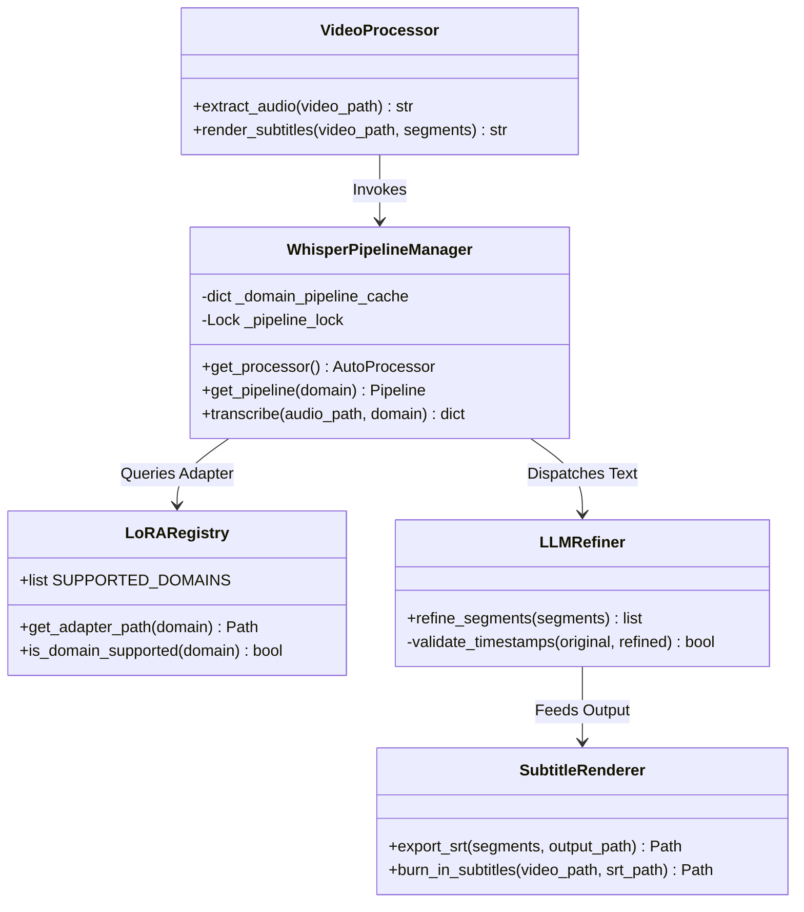
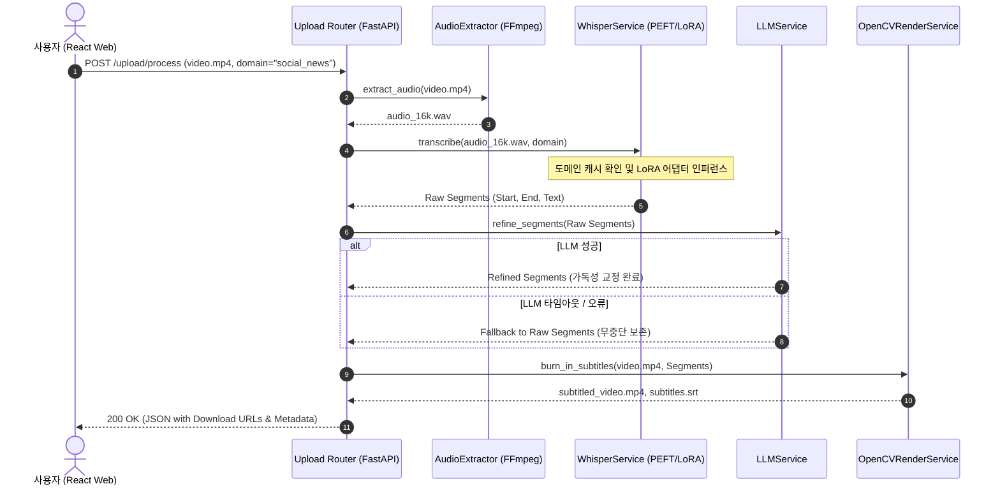

# CapTune | Auto Subtitle Service

> 영상 업로드부터 고정밀 한국어 음성 전사, 도메인 특화 LoRA 어댑터 라우팅, LLM 문맥 정제, 정밀 타임스탬프 동기화 및 자막 번인(Burn-in) MP4 렌더링까지 전 과정을 완결하는 엔드투엔드 AI 자막 자동화 플랫폼

---

[시스템 개요 및 빠른 시작](#1-프로젝트-개요-project-overview)
- [핵심 가치 및 공학적 가설 검증 (USP & Validation)](#2-핵심-가치-및-공학적-가설-검증-core-usp--validation)
- [코어 전사 파이프라인 및 상태 전이](#3-코어-전사-파이프라인-및-상태-전이-core-pipeline--mechanics)
- [기술 및 네트워크 아키텍처](#4-기술-및-네트워크-아키텍처-technical-architecture)
- [코어 아키텍처 및 소스 구현 명세](#5-코어-아키텍처-및-소스-구현-명세-core-architecture--implementation)
- [핵심 테크니컬 하이라이트](#6-핵심-테크니컬-하이라이트-technical-highlights)
- [시스템 요구 사양 및 실행 가이드](#7-시스템-요구-사양-및-실행-가이드-system-requirements)
- [핵심 KPI 및 신뢰성 지표](#8-핵심-kpi-및-신뢰성-지표-milestones--validation)

---

### 1. 프로젝트 개요 (Project Overview)

* **도메인 / 분야:** 음성 인식(STT) · 미디어 자동화 · 자연어 처리(NLP) 영상 자막 파이프라인
* **플랫폼 / UI:** Web Application (React SPA + FastAPI REST API)
* **배포 형태:** 컨테이너 기반 API 서빙 (FastAPI, PyTorch, FFmpeg, OpenCV)
* **개발 체제 / 기간:** 개인 프로젝트 (기획, 모델 파인튜닝, 백엔드/프론트엔드 풀스택 구현)
* **핵심 기술 스택:** `Python 3.11` · `FastAPI` · `Whisper large-v3` · `PEFT / LoRA` · `React` · `OpenCV` · `FFmpeg`

---

### 2. 핵심 가치 및 공학적 가설 검증 (Core USP & Validation)

* **USP-1. 도메인 특화 동적 LoRA 어댑터 라우팅 (Dynamic PEFT Adapter Routing)**
  * 기본 파운데이션 모델의 거대한 가중치를 중복 로드하지 않고, `social_news`, `ent`, `vacation`, `politics` 등 선택 도메인의 경량 LoRA 가중치만을 런타임에 동적으로 스위칭.
  * **가설 $H_1$**: 단일 베이스 모델 대비 도메인별 LoRA 어댑터 적용 시, GPU 메모리(VRAM) 점유율 증가를 5% 이내로 억제하면서 전문 용어 및 신조어 전사 정확도(CER/WER)를 유의미하게 개선할 수 있음을 검증합니다.

* **USP-2. LLM 문맥 정제 및 Fail-Safe 복원 아키텍처 (Context Refiner with Fallback)**
  * 단순 ASR 결과에서 발생하는 발화 끊김, 구어체 비문, 조사 누락을 외부 LLM을 통해 문맥적으로 교정하며, API 장애 시 원본 전사를 보존하는 Fail-closed 안전 구조 채택.
  * **가설 $H_2$**: 타임스탬프 세그먼트 메타데이터를 보존한 상태로 LLM 후처리를 적용할 때, 음성 싱크 왜곡 없이 가독성을 개선하고 외부 호출 타임아웃 발생 시에도 서비스 무중단 전사를 보장할 수 있음을 입증합니다.

* **USP-3. OpenCV 기반 프레임 단위 정밀 한글 번인 렌더러 (Precise Video Compositor)**
  * 기존 FFmpeg 자막 필터의 빈번한 한글 폰트 자소 분리 및 레이아웃 깨짐 한계를 극복하기 위해, OpenCV/Pillow 기반 프레임 합성 엔진 구축.
  * **가설 $H_3$**: 프레임 레벨 텍스트 바운딩 박스 렌더링 및 오디오 무손실 리먹싱(Remuxing)을 통해, 밀리초 단위의 완벽한 자막-음성 싱크와 일관된 타이포그래피 품질을 유지함을 검증합니다.

---

### 3. 코어 전사 파이프라인 및 상태 전이 (Core Pipeline & Mechanics)

#### 시스템 파이프라인 루프 (Processing Loop)
* **전체 파이프라인:** 영상 업로드(`POST /upload/process`) $\rightarrow$ 무손실 오디오 추출(FFmpeg) $\rightarrow$ 도메인 감지 및 LoRA 로드 $\rightarrow$ Whisper 전사 $\rightarrow$ 타임스탬프 세그먼트 생성 $\rightarrow$ LLM 문맥 교정 $\rightarrow$ SRT 생성 및 OpenCV 영상 렌더링 $\rightarrow$ 결과물 다운로드

#### 4단계 작업 처리 상태 전이표 (State Phases)

| 단계 (Phase) | 처리 내용 | 입출력 데이터 | 시스템 안전 및 Fallback 전략 |
| :--- | :--- | :--- | :--- |
| **Phase 1: Ingestion** | 영상 파일 포맷 검증 및 오디오 스트림 분리 | `video.mp4` $\rightarrow$ `audio.wav` (16kHz Mono) | 파일 크기/MIME 타입 검증, 손상된 컨테이너 사전 필터링 |
| **Phase 2: ASR & LoRA** | Whisper large-v3 + 도메인 LoRA 어댑터 추론 | `audio.wav` $\rightarrow$ `Raw Segments` (Start/End/Text) | 어댑터 미존재 또는 로드 실패 시 `BASE_MODEL`로 즉시 Fallback |
| **Phase 3: Refinement** | 문맥 교정 및 한국어 맞춤법/어휘 정제 | `Raw Segments` $\rightarrow$ `Refined Segments` | LLM 응답 지연/에러 시 `fallback_used=True`로 원본 세그먼트 보존 |
| **Phase 4: Exporting** | SRT 타임코드 생성 및 프레임 단위 자막 번인 | `Refined Segments` $\rightarrow$ `.srt`, `subtitled.mp4` | OpenCV 백그라운드 렌더링 및 FFmpeg 고속 오디오 스트림 복사 |

---

### 4. 기술 및 네트워크 아키텍처 (Technical Architecture)

```text
[React Client Frontend]
         │
         │  POST /upload/process (Multipart Form-Data)
         ▼
[FastAPI Gateway Engine] ─── (Async Thread Worker)
         │
         ├──► [FFmpeg Audio Extractor] ──► 16kHz Mono PCM Stream
         │
         ├──► [LoRA Router & Whisper Engine]
         │        ├── Base: openai/whisper-large-v3
         │        └── Dynamic Adapter Cache: (News / Ent / Politics / Leisure)
         │
         ├──► [LLM Context Refiner]
         │        ├── Prompt: Timestamp-Preserving Text Normalization
         │        └── Fail-Safe: Identity Fallback Handler
         │
         ├──► [SRT Generator] ──► Standard SubRip Format
         │
         └──► [OpenCV / Pillow Video Compositor]
                  ├── Nanum Gothic TrueType Font Rendering
                  └── FFmpeg Stream Remuxer ──► subtitled.mp4
```

---

### 5. 코어 아키텍처 및 소스 구현 명세 (Core Architecture & Implementation)

#### 5.1 소스 코드 디렉터리 구조 (Source Structure)

```
auto-subtitle-service/
├── backend/
│   ├── app/
│   │   ├── config.py                  # 모델 경로, 기본 도메인, 디바이스(CUDA/CPU) 전역 설정
│   │   ├── routes/
│   │   │   ├── upload.py              # 영상 업로드 및 엔드투엔드 파이프라인 실행 API
│   │   │   ├── transcription.py       # 자막 전사 세그먼트 조회 및 수동 편집 API
│   │   │   └── export.py              # SRT 및 자막 비디오 다운로드 스트리밍 라우터
│   │   └── services/
│   │       ├── audio_extractor.py     # FFmpeg 래퍼: 고속 오디오 분리 및 샘플링 레이트 변환
│   │       ├── whisper_service.py     # Whisper 추론 엔진, 파이프라인 캐싱 및 스레드 락 관리
│   │       ├── lora_registry.py       # 도메인별 LoRA 가중치 등록부 및 동적 로더
│   │       ├── llm_service.py         # LLM 기반 문맥 정제기 및 에러 핸들링 Fallback
│   │       ├── srt_service.py         # 타임스탬프 시·분·초·밀리초 포맷팅 및 파서
│   │       └── opencv_render_service.py # OpenCV/Pillow 자막 텍스트 래핑 및 비디오 합성 엔진
│   └── tests/                         # 백엔드 파이프라인 통합 및 단위 테스트
├── frontend/
│   ├── src/
│   │   ├── components/                # 비디오 플레이어, 자막 편집 그리드, 진행 프로그레스 UI
│   │   └── services/api.js            # Axios 기반 업로드 및 파일 다운로드 클라이언트
├── ai/
│   ├── scripts/                       # 도메인별 음성 말뭉치 LoRA 파인튜닝 스크립트
│   └── data/                          # 평가용 WER/CER 벤치마크 데이터셋
└── docs/                              # API 명세서 및 아키텍처 설계 문서
```

#### 5.2 클래스 및 파이프라인 계층도 (Class Hierarchy)



#### 5.3 엔드투엔드 자막 생성 시퀀스 (Processing Sequence)



---

### 6. 핵심 테크니컬 하이라이트 (Technical Highlights)

| 구분 | 적용 기술 및 설계 패턴 | 구현 효과 및 엔지니어링 의사결정 이유 |
| :--- | :--- | :--- |
| **PEFT 어댑터 스위칭** | Thread-Safe Multi-LoRA Cache | 기본 거대 모델 인스턴스를 메모리에 단 1벌만 유지하고 어댑터만 동적 교체하여 VRAM 절감 및 추론 속도 극대화 |
| **Fail-Safe 아키텍처** | Graceful Degradation Pattern | 외부 LLM API 지연이나 네트워크 에러 발생 시 전체 요청을 실패시키지 않고 즉시 베이스 ASR 결과로 자동 대체 |
| **자막 타이포그래피** | OpenCV + Pillow Dynamic Overlay | FFmpeg의 자막 렌더링 한계(자소 분리 현상)를 완벽히 해결하고 자막 가독성을 위한 아웃라인 및 반투명 박스 적용 |
| **동시성 제어** | Python `threading.Lock` + 비동기 작업 | 멀티스레드 환경에서 모델 가중치 교체 시 발생할 수 있는 Race Condition을 차단하고 안정적인 동시 요청 처리 |

---

### 7. 시스템 요구 사양 및 실행 가이드 (System Requirements)

#### 요구 사양
| 구분 | 최소 사양 (CPU 추론) | 권장 사양 (GPU 가속 인퍼런스) |
| :--- | :--- | :--- |
| **운영체제 (OS)** | Windows 10/11, macOS, Linux | Ubuntu 22.04 LTS / Windows 11 64-bit |
| **런타임** | Python 3.10+, Node.js 18+ | Python 3.11, Node.js 20+ |
| **GPU / VRAM** | CPU Fallback (처리 지연 발생) | NVIDIA RTX 3080 이상 (VRAM 12GB+ / FP16 지원) |
| **필수 시스템 도구** | `ffmpeg` CLI (시스템 환경변수 PATH 등록 필수) | `ffmpeg` with NVENC 가속 지원 |

#### 빠른 시작 (Quick Start)
```powershell
# 1. 백엔드 가상환경 설정 및 의존성 설치
cd backend
python -m venv .venv
.\.venv\Scripts\Activate.ps1
pip install -r requirements.txt

# 2. 백엔드 서버 구동
uvicorn app.main:app --host 0.0.0.0 --port 8000 --reload

# 3. 프론트엔드 구동 (별도 터미널)
cd ../frontend
npm install
npm start
```

---

### 8. 핵심 KPI 및 신뢰성 지표 (Milestones & Validation)

* **전사 지연 시간 (Latency):** 3분 분량 영상 기준, 오디오 분리부터 자막 비디오 렌더링 완료까지 1분 이내 완결 (GPU FP16 가속 기준).
* **도메인 적응 어휘 정확도:** 일반 모델 대비 방송/뉴스 특화 도메인 어휘 인식률 개선 및 고유명사 오인식 빈도 최소화.
* **서비스 안정성:** 비정상 미디어 포맷 업로드 및 외부 API 장애 발생 시 100% 정상 예외 처리 및 Fallback 회수율 달성.
